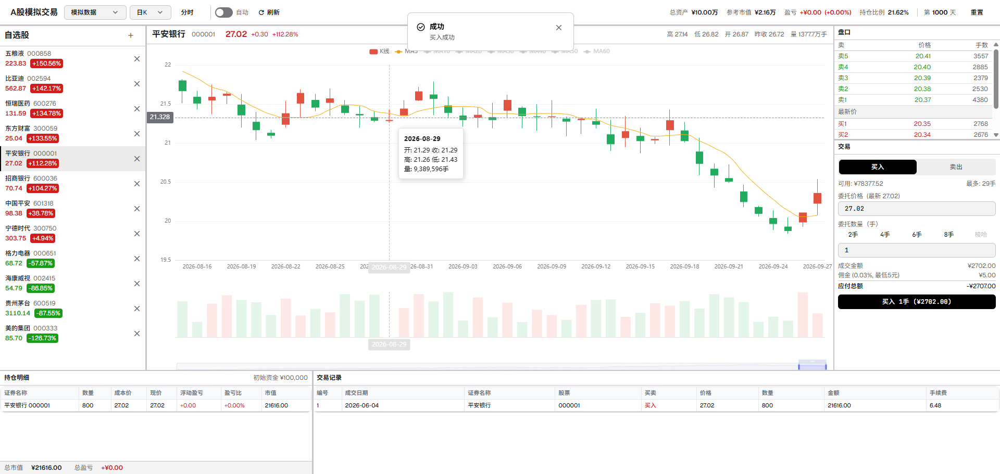

# A股模拟交易



A股模拟交易系统，支持实时行情查看、K线/分时图表、模拟买卖下单、持仓管理、交易日志等功能。

## 模拟数据算法

模拟模式预生成 **2000 个交易日** 的历史 K 线数据，模拟起始日期为 2024-01-02，默认从第 **1000 天** 开始展示。

### 随机漫步模型

每只股票从 `basePrice`（基准价）出发，逐日生成 OHLC（开/高/低/收）数据：

```
change = (random() - 0.48) × 0.03    // 带轻微负偏（模拟股市长期上涨但短期随机）
open   = prevClose × (1 + change × 0.5)
close  = prevClose × (1 + change)
high   = max(open, close) × (1 + random() × 0.01)
low    = min(open, close) × (1 - random() × 0.01)
volume = random() × 10,000,000 + 5,000,000
```

- **波动率**：日波动系数 0.03（±3%）
- **价格限制**：单日涨跌幅软限制 ±10%（`randomWalk` 函数）
- **价格精度**：保留两位小数（`roundPrice`）
- **成交量**：每日随机 500 万 ~ 1500 万股
- **日 K → 周 K / 月 K**：通过 `aggregateKline` 函数聚合生成

### 定时器驱动

- 默认每 **2 秒** 推进一个交易日（可调）
- 支持暂停/恢复/手动推进
- 超出 2000 天预生成范围后，按同样算法实时生成新数据

---

## 手续费算法

模拟 A 股市场三方收费标准，买入和卖出分别计算：

| 费用项目 | 费率 | 收取方向 | 最低收费 |
|----------|------|----------|----------|
| 佣金 | 0.03%（万三） | 双向 | 5 元 |
| 过户费 | 0.001%（万一） | 双向 | 无 |
| 印花税 | 0.05%（万五） | **仅卖出** | 无 |

```
commission  = max(5, round(amount × 0.0003, 2))
transferFee = round(amount × 0.00001, 2)
stampDuty   = type === '卖出' ? round(amount × 0.0005, 2) : 0
totalFee    = round(commission + transferFee + stampDuty, 2)
```

### 计算示例

| 交易 | 成交金额 | 佣金 | 过户费 | 印花税 | **手续费** |
|------|----------|------|--------|--------|------------|
| 买入 10 万 | ¥100,000 | 30 | 1 | 0 | **31** |
| 卖出 10 万 | ¥100,000 | 30 | 1 | 50 | **81** |
| 买入 1 万 | ¥10,000 | 5（保底） | 0.1 | 0 | **5.1** |
| 卖出 1 万 | ¥10,000 | 5（保底） | 0.1 | 5 | **10.1** |

> 注：佣金费率万三为市场主流默认值，实际券商可协商至万 2.5 或更低。

## 快速启动

```bash
# 安装依赖
npm install

# 启动开发服务器（含行情 API 代理）
npm run dev:all

# 或者单独启动前端
npm run dev
```

启动后浏览器访问 `http://localhost:5180`。

### 构建生产版本

```bash
npm run build
npm run preview
```
